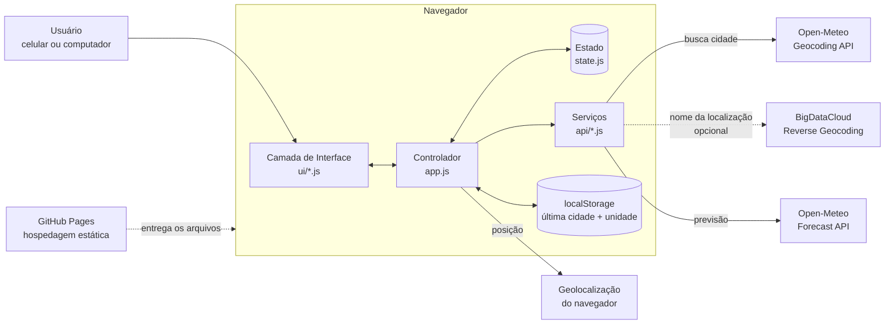
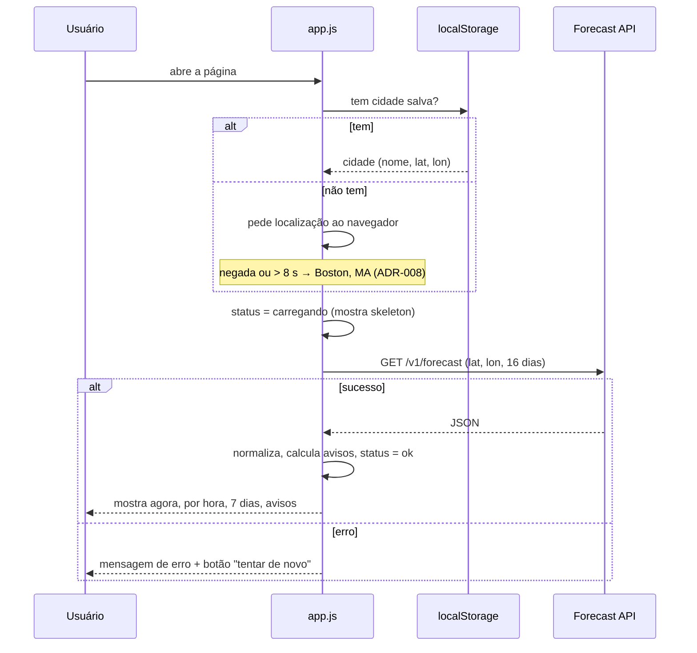

# 02 — Arquitetura

## 1. Visão geral

Aplicação **100% no navegador** (client-side), sem servidor próprio. O navegador busca os dados direto de duas APIs públicas e gratuitas da Open-Meteo.



## 2. Camadas e responsabilidades

| Camada | Arquivo(s) | Faz | Não faz |
|--------|-----------|-----|---------|
| **Serviços (dados)** | `js/api/geocoding.js`, `js/api/forecast.js` | Monta a URL, chama a API, trata erro HTTP/rede, devolve dados **normalizados** | Não mexe na tela |
| **Domínio (regras)** | `js/domain/weather-codes.js`, `js/domain/units.js`, `js/domain/alerts.js` | Traduz código WMO → descrição/ícone em PT-BR; converte unidades; calcula risco de tempestade e avisos | Não chama API, não mexe na tela |
| **Estado** | `js/state.js` | Guarda cidade atual, dados, unidade (°C/°F), período (7/15 dias), status (carregando/erro/ok) | — |
| **Interface** | `js/ui/*.js` | Desenha cada bloco (busca, agora, por hora, diário, avisos, erro) a partir do estado | Não chama API diretamente |
| **Controlador** | `js/app.js` | Liga tudo: evento do usuário → serviço → estado → interface | — |

**Por quê separar assim:** cada parte pode ser trocada ou testada sozinha. Exemplo: se um dia a Open-Meteo sair do ar, só `js/api/` muda.

## 3. Estrutura de pastas

```
previsao-tempo/
├── index.html
├── css/
│   └── styles.css          # visual + cenários do céu
├── js/
│   ├── app.js              # controlador
│   ├── state.js            # estado único
│   ├── storage.js          # localStorage seguro (nunca quebra)
│   ├── api/
│   │   ├── http.js         # fetch com tempo-limite e erros classificados
│   │   ├── geocoding.js    # busca de cidade + nome da localização
│   │   └── forecast.js     # previsão + normalização
│   ├── domain/
│   │   ├── weather-codes.js
│   │   ├── units.js
│   │   ├── time.js         # horários no fuso da cidade
│   │   ├── scene.js        # o que o céu mostra agora (ADR-011)
│   │   └── alerts.js       # risco de tempestade + avisos
│   └── ui/
│       ├── dom.js          # cria elementos com texto seguro
│       ├── icons.js        # ícones SVG próprios
│       ├── search.js
│       ├── current.js
│       ├── hourly.js
│       ├── daily.js
│       ├── details.js      # "Hoje em detalhe"
│       ├── alerts.js
│       ├── background.js   # céu animado + modo demo
│       └── status.js       # erros e avisos rápidos
├── docs/ (01 a 05)
└── README.md
```

## 4. Fluxos principais

### 4.1 Abrir o site



### 4.2 Buscar cidade
1. Usuário digita (2+ letras). Espera 300 ms sem digitar (*debounce*) para não chamar a API a cada tecla.
2. `geocoding.js` chama `geocoding-api.open-meteo.com/v1/search?name=...&count=5&language=pt`.
3. Mostra até 5 sugestões. Nenhuma → "Cidade não encontrada".
4. Ao escolher → fluxo 4.1 com a nova cidade, e salva no navegador.

### 4.3 Usar minha localização
1. `navigator.geolocation.getCurrentPosition`.
2. Permitido → lat/lon → fluxo 4.1. Nome da cidade exibido como "Sua localização".
3. Negado/indisponível → mensagem: "Não foi possível obter sua localização. Busque uma cidade."

### 4.4 Alternar °C/°F e 7/15 dias
- **Sem nova chamada à API.** Os dados chegam sempre em °C, km/h e mm, e 16 dias de uma vez. A conversão e o corte (7 ou 15) são feitos no navegador. Resultado: troca instantânea e menos pontos de falha.

## 5. Contrato com a API (uma chamada só)

```
GET https://api.open-meteo.com/v1/forecast
  ?latitude={lat}&longitude={lon}
  &timezone=auto
  &forecast_days=16
  &current=temperature_2m,apparent_temperature,relative_humidity_2m,
           weather_code,wind_speed_10m,wind_direction_10m,is_day,
           precipitation,rain,showers,snowfall
  &minutely_15=precipitation,snowfall&forecast_minutely_15=8
  &hourly=temperature_2m,precipitation_probability,weather_code,is_day,cape
  &daily=weather_code,temperature_2m_max,temperature_2m_min,
         precipitation_probability_max,snowfall_sum,uv_index_max,
         sunrise,sunset,wind_speed_10m_max,wind_gusts_10m_max
```

Uma única chamada traz tudo o que as telas precisam. `timezone=auto` faz as horas virem no fuso da cidade (RNF-04).

## 6. Regras de domínio (derivadas)

### 6.1 Risco de tempestade (RF-13)
| Condição (no dia ou na hora) | Risco |
|---|---|
| Código WMO 95, 96, 97 ou 99 | **Alto** |
| CAPE ≥ 1000 J/kg **e** chance de chuva ≥ 40% | **Moderado** |
| Demais casos | **Baixo** |

> Estimativa do site, não previsão oficial. Limites a validar com o Galeno.

### 6.2 Avisos automáticos (RF-14)
| Aviso | Gatilho (próximas 24h / hoje) |
|---|---|
| Calor intenso | Máx ≥ 35 °C |
| Frio intenso | Mín ≤ 0 °C |
| UV muito alto | UV máx ≥ 8 |
| Vento forte | Rajada máx ≥ 60 km/h |
| Tempestade | Risco "Alto" (6.1) |
| Neve | Neve prevista > 0 cm |

Todos exibidos com o rótulo **"Aviso automático — não oficial"**.

## 7. Tratamento de erros

| Situação | Detecção | Mensagem |
|---|---|---|
| Sem internet | `navigator.onLine === false` ou falha de rede no `fetch` | "Sem conexão. Verifique sua internet." + tentar de novo |
| API fora do ar / lenta | HTTP ≠ 200 ou timeout de 10 s | "Serviço de clima indisponível no momento." + tentar de novo |
| Cidade não encontrada | Geocoding sem resultados | "Nenhuma cidade encontrada com esse nome." |
| Localização negada | Erro da geolocalização | "Localização não permitida. Busque uma cidade." |

## 8. Segurança e privacidade
- Sem chaves, senhas ou dados pessoais no código.
- Localização usada só no momento, **não é guardada**. Só o nome e as coordenadas da cidade escolhida ficam no `localStorage`.
- Textos vindos da API são inseridos como texto (`textContent`), nunca como HTML, para evitar injeção de código.
- Geolocalização exige HTTPS — o GitHub Pages já entrega HTTPS.
